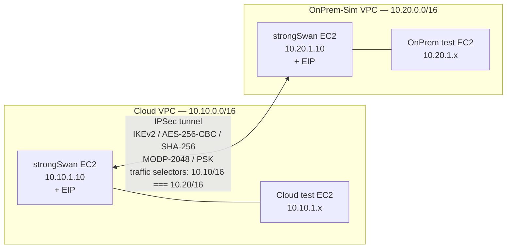

# Architecture

## VPC topology and tunnel

## Why each VPC needs source/destination check disabled

Each `strongSwan` EC2 routes encapsulated traffic destined for the peer VPC's private subnet through itself. By default, AWS drops packets when the source or destination IP doesn't match the instance's ENI — assuming a security violation. Setting `source_dest_check = false` on the VPN ENIs allows the instances to forward third-party traffic.

This is a small but critical detail; missing it manifests as "the tunnel is up but ping doesn't work."

## IPSec cipher suite chosen

| Layer | Setting | Why |
|---|---|---|
| IKE version | IKEv2 | Fewer round trips than IKEv1; supports modern features (DPD, MOBIKE) |
| IKE encryption | AES-256-CBC | Industry standard; broadly supported; FIPS-eligible |
| IKE PRF / integrity | HMAC-SHA-256 | SHA-1 is deprecated; SHA-256 has wide hardware acceleration |
| DH group | MODP-2048 (group 14) | Smallest acceptable group; group 19+ (ECDH) is stronger but slower |
| Authentication | Pre-shared key | Simple for a lab; production should use certificates |
| ESP encryption | AES-256-CBC | Matches IKE for consistency |
| Tunnel vs Transport | Tunnel | Original IP packet is encrypted in full + encapsulated |

## Security group requirements

Each VPN EC2 needs the following inbound rules from the peer's EIP:

| Protocol | Port | Purpose |
|---|---|---|
| UDP | 500 | IKE negotiation |
| UDP | 4500 | NAT-T (encapsulates ESP in UDP when NAT is on path) |
| ESP (proto 50) | — | The encrypted payload itself |
| ICMP | — | Optional, for tunnel ping verification |

## Connection to real AWS Site-to-Site VPN

AWS Site-to-Site VPN runs the same protocol stack under the hood. Building it manually proves understanding of every layer; in production, you'd typically use the managed service for HA and automated failover, but knowing what's actually happening when AWS shows you a "tunnel status" page is what differentiates an operator from a clicker.
