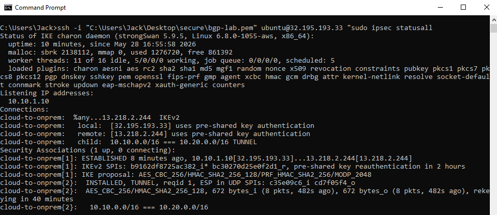
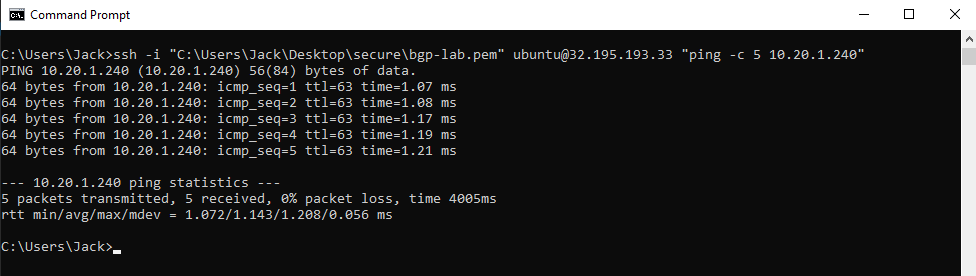

# AWS Hybrid VPN Lab


Simulates a hybrid cloud network by building an encrypted site-to-site VPN between two isolated AWS VPCs — one representing a cloud environment, one representing an on-premises data center. Built entirely with Terraform using strongSwan, the same IPSec stack that powers AWS Site-to-Site VPN under the hood.

> ### Tunnel verified end-to-end
>
> strongSwan IKEv2 / AES-256-CBC / SHA-256 / MODP-2048 between two VPCs, brought to ESTABLISHED and **verified with end-to-end ping: 5/5 received, 0% loss, sub-2ms RTT across the encrypted tunnel.**
>
> 
>
> End-to-end ping across the encrypted tunnel (5/5 received, 0% loss, sub-2ms RTT):
>
> 
>
> Supporting captures (AWS describes, route tables, architecture): [`Documentation/`](Documentation/)

## Repository Tour

- **[`terraform/`](terraform/)** — VPCs, EC2, EIPs, route tables, security groups for the tunnel
- **[`config/`](config/)** — strongSwan `ipsec.conf` templates for the cloud and on-prem sides
- **[`Documentation/`](Documentation/)** — deployment evidence, terminal captures, architecture

## The Problem

Every enterprise network already exists before cloud adoption begins. The real challenge isn't building in cloud — it's connecting cloud securely to what's already there: on-prem data centers, co-location facilities, existing MPLS circuits. This lab demonstrates the core skill: establishing encrypted hybrid connectivity.

**Healthcare context:** Clinical workloads often can't fully migrate to cloud. A hybrid VPN enables cloud bursting for analytics, backup to S3, or running DMZ workloads in AWS while keeping PHI on-premises.

## Architecture


Two VPCs simulate a hybrid cloud topology - one acting as the AWS cloud side, one acting as an on-prem data center:

- **Cloud VPC** (`10.10.0.0/16`) - strongSwan EC2 at `10.10.1.10`, EIP for IKE/ESP termination
- **OnPrem-Sim VPC** (`10.20.0.0/16`) - strongSwan EC2 at `10.20.1.10`, EIP for IKE/ESP termination

Each VPC also has a test EC2 in its private space (cloud-test 10.10.1.x, onprem-test 10.20.1.x) used to verify end-to-end connectivity through the tunnel.

| Layer | Setting |
|---|---|
| IKE version | IKEv2 |
| Encryption | AES-256-CBC |
| Integrity | HMAC-SHA-256 |
| DH group | 14 (2048-bit MODP) |
| Authentication | Pre-shared key |
| Tunnel mode | Tunnel (not transport) |

Route tables on both VPCs send the peer CIDR through the strongSwan ENI. Security groups allow ESP (proto 50), IKE (UDP 500), and NAT-T (UDP 4500) inbound between the two EIPs.


*Full diagram: [Documentation/architecture.md](Documentation/architecture.md)*

| Parameter | Value |
|-----------|-------|
| Cloud VPC CIDR | 10.10.0.0/16 |
| OnPrem-Sim VPC CIDR | 10.20.0.0/16 |
| Tunnel Protocol | IKEv2 |
| Encryption | AES-256-CBC |
| Integrity | SHA-256 HMAC |
| DH Group | 14 (2048-bit) |
| Instances | 2x t2.micro (free tier) |

## How It Works

### Packet Flow: Cloud Test EC2 → OnPrem Test EC2

1. Test EC2 in Cloud VPC sends packet to `10.20.1.x`
2. Route table entry `10.20.0.0/16 → strongSwan ENI` intercepts it
3. strongSwan on Cloud instance encrypts payload with AES-256, wraps in ESP
4. Encrypted packet leaves via EIP, traverses public internet to OnPrem EIP
5. OnPrem strongSwan decrypts, checks IKE SA, delivers decrypted packet to destination

**Why source/dest check must be disabled:** AWS enforces that an EC2 instance only processes traffic where it is the source or destination. Disabling this flag allows the strongSwan instance to act as a router — forwarding packets on behalf of other hosts. This is the AWS equivalent of enabling IP forwarding on a Cisco interface (`ip routing`).

### IKEv2 Phases

| Phase | What happens |
|-------|-------------|
| IKE_SA_INIT | Exchange crypto algorithms, DH public keys, nonces |
| IKE_AUTH | Mutual authentication via PSK, establish first CHILD_SA |
| CHILD_SA | Negotiate ESP keys for data encryption |

This maps directly to IOS: IKE Phase 1 = `show crypto isakmp sa`, IKE Phase 2 = `show crypto ipsec sa`.

## Prerequisites

- AWS account (Free Tier eligible)
- Terraform >= 1.5 installed
- AWS CLI configured (`aws configure`)
- An existing EC2 key pair in your target region
- [strongSwan knowledge not required — configs are provided]

## Quick Start

```bash
git clone https://github.com/SalamoneJack/aws-hybrid-vpn-lab.git
cd aws-hybrid-vpn-lab/terraform

cp terraform.tfvars.example terraform.tfvars
# Edit terraform.tfvars: set your key_pair name

terraform init
terraform plan
terraform apply
```

Terraform outputs the EIPs and SSH commands. Then follow the strongSwan config steps below.

## Deployment

### 1. Terraform Variables

`terraform/terraform.tfvars.example`:
```hcl
region      = "us-east-1"
key_pair    = "your-key-pair-name"
```

### 2. Deploy Infrastructure

```bash
terraform apply
```

Note the outputs — you'll need the EIPs for strongSwan config.

### 3. Configure strongSwan — Cloud Instance

```bash
ssh -i ~/.ssh/your-key.pem ubuntu@<cloud_vpn_eip>
```

`/etc/ipsec.conf`:
```
config setup
    charondebug="ike 1, knl 1, cfg 0"

conn cloud-to-onprem
    keyexchange=ikev2
    left=%defaultroute
    leftid=<cloud_vpn_eip>
    leftsubnet=10.10.0.0/16
    right=<onprem_vpn_eip>
    rightid=<onprem_vpn_eip>
    rightsubnet=10.20.0.0/16
    authby=secret
    auto=start
    ike=aes256-sha256-modp2048!
    esp=aes256-sha256!
```

`/etc/ipsec.secrets`:
```
<cloud_vpn_eip> <onprem_vpn_eip> : PSK "your-strong-preshared-key"
```

```bash
sudo ipsec restart
```

### 4. Configure strongSwan — OnPrem-Sim Instance

Mirror config (swap left/right values):

```
conn onprem-to-cloud
    keyexchange=ikev2
    left=%defaultroute
    leftid=<onprem_vpn_eip>
    leftsubnet=10.20.0.0/16
    right=<cloud_vpn_eip>
    rightid=<cloud_vpn_eip>
    rightsubnet=10.10.0.0/16
    authby=secret
    auto=start
    ike=aes256-sha256-modp2048!
    esp=aes256-sha256!
```

```bash
sudo ipsec restart
```

## Verification

```bash
# On either VPN instance — tunnel should show ESTABLISHED
sudo ipsec status

# Expected:
# Security Associations (1 up, 0 connecting):
# cloud-to-onprem[1]: ESTABLISHED 12 seconds ago

# From Cloud test EC2 — ping across the tunnel
ping 10.20.1.x

# From OnPrem test EC2 — ping the other way
ping 10.10.1.x

# Verify route table is directing traffic through VPN instance
ip route show
```

See `Documentation/` for expected output.

## Production Considerations

| Aspect | This Lab | Production |
|--------|----------|------------|
| VPN endpoint | Software (strongSwan EC2) | AWS Site-to-Site VPN |
| Cost | $0 free tier | ~$36/mo per VPN connection |
| Redundancy | Single tunnel, single AZ | Two tunnels, two Customer Gateways |
| Routing | Static routes | BGP dynamic routing (see [aws-bgp-dynamic-routing-lab](https://github.com/SalamoneJack/aws-bgp-dynamic-routing-lab)) |
| Throughput | ~1 Gbps (EC2 NIC) | 1.25 Gbps per tunnel (managed) |
| Monitoring | Manual ipsec status | CloudWatch VPN metrics + alarms |
| On-prem hardware | EC2 simulation | Cisco ASR/ISR, FortiGate, Palo Alto |

**For healthcare production:** AWS Direct Connect with VPN backup is the standard architecture. Direct Connect provides a dedicated physical circuit (not internet-routed), meeting HIPAA requirements for network isolation. VPN serves as encrypted failover.

## Cost

| Resource | Monthly Cost |
|----------|-------------|
| 2× t2.micro (Free Tier eligible) | $0 |
| 2× Elastic IPs (attached to running instances) | $0 |
| Data transfer (cross-VPC, minimal lab traffic) | ~$0 |
| **Total** | **$0** |

Run `terraform destroy` when finished. Unattached EIPs cost $0.005/hr.

## Engineering notes

- The gap between "tunnel ESTABLISHED" and "traffic flowing" — you need both the IKE SA and correct route table entries pointing at the strongSwan ENI
- `source_dest_check = false` is the AWS equivalent of `ip routing` on a Cisco interface — without it, the instance drops forwarded packets
- IKEv2's IKE_SA_INIT and IKE_AUTH phases map 1:1 to IOS `show crypto isakmp sa` Phase 1 and Phase 2 states
- `ike=aes256-sha256-modp2048!` — the `!` means "only this, no fallback" — equivalent to Cisco's strict transform set
- AWS security groups must explicitly allow IP protocol 50 (ESP) and UDP 4500 (NAT-T) for IPSec to traverse

## Related Projects

- [aws-bgp-dynamic-routing-lab](https://github.com/SalamoneJack/aws-bgp-dynamic-routing-lab) — Adds FRR + BGP dynamic routing over this tunnel
- [aws-multi-vpc-hub-spoke](https://github.com/SalamoneJack/aws-multi-vpc-hub-spoke) — Enterprise segmentation patterns
- [aws-network-monitoring](https://github.com/SalamoneJack/aws-network-monitoring) — VPC Flow Logs and CloudWatch observability
